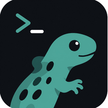

# cammander

<p align="center">
  
</p>

<p align="center">
  <strong>AI-powered workspace harness for your projects.</strong><br>
  Command center: terminal, streaming LLM chat, and code editor — in the browser.
</p>

<p align="center">
  
  
  =20-green?style=flat-square&logo=node.js" alt="Node.js" />
  <br>
  
  
  
  
  
  <br>
  
  
  
</p>

---

**cammander** (named with love) is a browser-based AI coding harness. Pairing a local workspace file tree with a real PTY terminal, streaming LLM chat with tool-calling, and an always-dark code editor, it brings Claude Code-like power to your own server.

- Run your tools locally via **bash, read, write, grep, list** through a multi-turn agent loop
- Browse and switch projects from a live file tree sidebar
- Chat with models via **Ollama Cloud** (or bring your own provider)
- Never lose context: auto-loads `HQ.md` / `AGENTS.md` / `CLAUDE.md` from your workspace root as the system prompt
- Designed for desktop and mobile — warm flat design, teal accent, always-dark editor

## What It Looks Like

```
┌─────────────────────────────────────────────────────────┐
│  [logo]  cammander                              ⚙  ×  │
├──┬──────────────────────────────────────────────────────┤
│  │  ┌──────────────────┬───────────────────────────────┐│
│ 📁│  │ Chat with AI     │  code.js [x]  README.md [x] ││
│ 📂│  │ ──────────────── │ ┌────────────────────────────┐│
│ 📄│  │ User: fix this   │ │ function add(a, b) {     ││
│ 📊│  │                  │ │   return a + b;            ││
│ 📂│  │ [Tool: bash] $   │ │ }                        ││
│  │  │ git diff ...     │ │                          ││
│  │  │ ──────────────── │ └────────────────────────────┘│
│  │  │                  │  $ ls -la                    │
│  │  │                  │  .  ..  src  package.json    │
│──┴──┴──────────────────┴──────────────────────────────┤
│  >                                                    │
└─────────────────────────────────────────────────────────┘
```

## Features

| Feature | Details |
|---------|---------|
| **Real PTY Terminal** | xterm.js + node-pty + Socket.IO. Full Bash/zsh, not a simulation. Catppuccin theme included. |
| **Streaming LLM Chat** | SSE-based with multi-turn tool-calling loop — bash, read, write, grep, list. |
| **Code Editor** | Syntax highlighting, multi-tab, persistent file state. **Always dark** even in light mode. |
| **Syntax Highlighting** | TSX, Python, Rust, Go, Shell, YAML, TOML, CSV, Markdown, SQL, JSON, Dockerfile, dotenv. |
| **Workspace Picker** | Browse and switch projects from the sidebar. Auto-detects project roots. |
| **Web Apps Panel** | Auto-detects local dev servers; open `cammander.json` for explicit app links. |
| **Project Soul** | Auto-loads `HQ.md` / `AGENTS.md` / `CLAUDE.md` from workspace root as system prompt. |
| **Dark/Light/System** | Warm flat design with teal accents. No gradients, no noise, no dotted borders. |
| **Mobile-First** | Adaptive layout, touch-friendly grids, viewport-aware terminal. |
| **Settings Panel** | Provider/model/config UI backed by `data/settings.json`. |
| **Spreadsheet Viewer** | Inline `.csv`, `.xlsx`, `.xls` rendering with sortable columns. |

## Architecture

```
Browser (port 3001)
  |
  proxy.js  ── static files + WebSocket upgrade + /api proxy
  |
  Backend (port 3002)
  ├── /api/chat          ── streaming chat + tool loop
  ├── /api/files         ── read / write / list / delete
  ├── /api/sessions      ── chat session CRUD
  ├── /api/settings      ── provider + model config
  ├── /api/project       ── workspace + web-apps discovery
  ├── /api/git           ── status / branch / log
  ├── /api/model-gateway ── route to Ollama / OpenAI / local
  └── WS /terminal       ── real PTY via node-pty
```

## Quick Start

The fastest path from zero to running:

```bash
git clone https://github.com/GuideboardLabs/cammander.git
cd cammander
npm install
cd apps/backend && npm install && cd ../..

# One-time build
npm run build:shared && npm run build:backend

# Start
cd apps/backend && PORT=3002 node dist/main.js &
cd ../.. && node proxy.js &

open http://localhost:3001
```

📖 For detailed installation, troubleshooting, and deployment, see **[INSTALL.md](./INSTALL.md)**.

## Tech Stack

| Layer | Technology |
|-------|------------|
| **Frontend** | Vanilla HTML/CSS/JS prototype (`prototype.html`), React 19 + Vite (secondary) |
| **Backend** | NestJS 11, Express, Socket.IO 4.8 |
| **Terminal** | node-pty (real PTY), xterm.js 5.5, Catppuccin theme |
| **AI / Models** | Ollama Cloud API (default), OpenAI-compatible local route |
| **Editor** | Monaco Editor (via `@monaco-editor/react`) |
| **Build** | TypeScript 5.6, Vite 6 |
| **Testing** | Vitest, React Testing Library, Jest |
| **Proxy** | Node `http-proxy` for static + WS + API gateway |

## Project Structure

```
cammander/
├── prototype.html               ← Primary frontend (single file, warm flat design)
├── proxy.js                     ← HTTP + WebSocket proxy (port 3001 → 3002)
├── new-features.css             ← Incremental UI patches (copy buttons, tool cards, etc.)
├── HQ.md                        ← Project soul — loaded as system prompt
├── manifest.json                ← PWA manifest
├── package.json                 ← Root workspace config (npm workspaces)
├── apps/
│   ├── backend/                 ← NestJS server
│   │   ├── src/
│   │   │   ├── main.ts
│   │   │   ├── app.module.ts
│   │   │   ├── modules/
│   │   │   │   ├── chat/              → Streaming chat + tool-call loop
│   │   │   │   ├── terminal/          → PTY WebSocket gateway (node-pty)
│   │   │   │   ├── tools/             → bash, read_file, write_file, grep, list_files
│   │   │   │   ├── sessions/          → Chat session store
│   │   │   │   ├── settings/          → Provider/model configuration
│   │   │   │   ├── files/             → File CRUD operations
│   │   │   │   ├── git/               → Git metadata endpoints
│   │   │   │   ├── project/           → Workspace + web-apps discovery
│   │   │   │   ├── model-gateway/     → LLM API routing
│   │   │   │   ├── filesystem/        → FS abstractions
│   │   │   │   ├── model-routing/     → Model selection logic
│   │   │   │   ├── searxng-search/    → Web search via SearXNG
│   │   │   │   ├── tool-registry/     → Tool discovery & schema
│   │   │   │   ├── agent-orchestrator/→ Agent coordination
│   │   │   │   └── cloak-browser/     → Headless browser automation
│   │   │   └── gateway/
│   │   └── dist/                ← Built output
│   └── frontend/                ← React + Vite app (secondary build)
│       ├── src/
│       │   └── components/
│       │       ├── FileTree.tsx
│       │       ├── EditorTabs.tsx
│       │       ├── EditorPane.tsx
│       │       ├── WebAppsPanel.tsx
│       │       └── SpreadsheetViewer.tsx
│       └── vite.config.ts
├── shared/                      ← Shared TypeScript configs (tsconfig.json)
└── assets/                      ← Icons, logos, manifest images
    ├── logo-32.png
    ├── logo-64.png
    ├── logo-128.png
    ├── apple-touch-icon.png
    ├── icon-192.png
    └── icon-512.png
```

## Provider Configuration

cammander ships with a **Model Gateway** that routes requests to your chosen provider. Supported providers: `ollama-cloud`, `ollama-local`, `openai-compat`. Via the settings panel (gear icon) or `data/settings.json`:

```json
{
  "activeProvider": "ollama-cloud",
  "ollamaCloud": {
    "baseUrl": "https://ollama.com/v1",
    "apiKey": "sk-..."
  },
  "defaultModel": "deepseek-v4-flash"
}
```

> ⚠️ Use `https://ollama.com/v1` — `https://api.ollama.com` redirects and drops the `Authorization` header.

## Requirements

- **Node.js** `>= 20`
- **OS:** macOS, Linux, Windows (WSL)
- **PTY:** Unix-like systems recommended (node-pty uses native `pty`).

## License

[MIT](./LICENSE) — © 2026 Guideboard Labs
